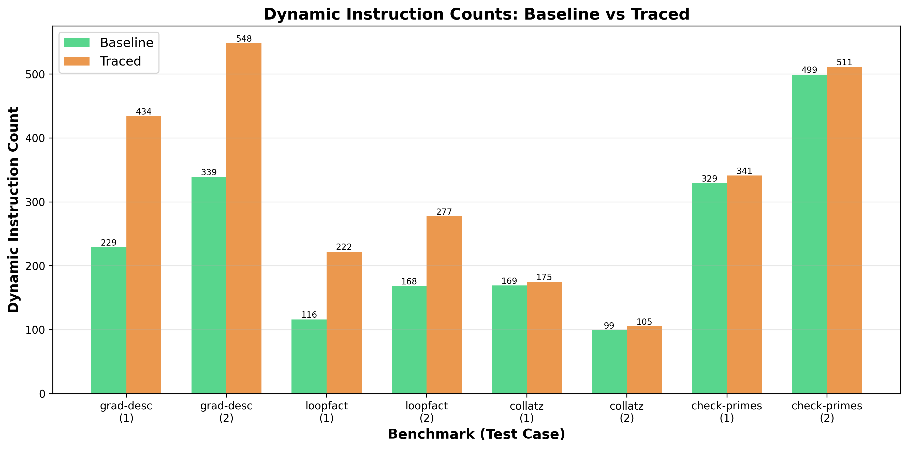

# Trace-Based Speculative Optimization for Bril

### Team Members
Ning Wang (nw366), Jiale Lao (jl4492)

### Source Code
https://github.com/NingWang0123/cs6120/tree/main/assa10

---

## Implementation Summary

We implemented a **trace-based speculative optimizer** for Bril that mimics tracing JIT compilation in a profile-guided AOT setting. The system has three main phases:

1. **Trace Generation** (`tracer_dynamic.py`): A modified interpreter that records execution traces by capturing instructions as they execute, converting branches to guards, and eliminating jumps.

2. **Trace Injection** (`inject.py`): Injects the extracted trace back into the original program using speculation primitives (`speculate`, `guard`, `commit`) to create a "fast path" while maintaining the original code as a fallback.

3. **Speculative Execution** (`spec.py`): An interpreter that supports the Bril speculation extension, handling state snapshots and rollback on guard failures.

The implementation extracts a single hot execution path, wraps it with speculation primitives, and measures performance using dynamic instruction counting.

We did not implement trace optimization and the interprocedural version because of time limitation.

---

## Testing Methodology

We tested the implementation on **4 benchmarks** from the Bril core suite, each with multiple inputs:

1. **Correctness Verification**: Compare outputs of original vs. traced programs to ensure semantic equivalence
2. **Performance Measurement**: Count dynamic instructions executed using the speculation-aware interpreter
3. **Multiple Input Testing**: Test each benchmark with:
   - The input used to generate the trace
   - Different inputs that may follow different execution paths

### Test Benchmarks

| Benchmark | Description |
|-----------|-------------|
| **grad_desc** | Gradient descent optimization loop |
| **loopfact** | Iterative factorial calculation |
| **collatz** | Collatz conjecture sequence with complex control flow |
| **check-primes** | Prime number checker with nested loops |

---

## Evaluation Results

### Performance Summary

| Benchmark | Input | Baseline | Traced | Overhead | Overhead % | Correct |
|-----------|-------|----------|--------|----------|------------|---------|
| **grad_desc** | w=6000 t=2000 lr=100 steps=20 | 229 | 434 | +205 | +89.5% | ✓ |
| **grad_desc** | w=8000 t=3000 lr=150 steps=30 | 339 | 548 | +209 | +61.7% | ✓ |
| **loopfact** | input=8 | 116 | 222 | +106 | +91.4% | ✓ |
| **loopfact** | input=12 | 168 | 277 | +109 | +64.9% | ✓ |
| **collatz** | x=7 | 169 | 175 | +6 | +3.6% | ✓ |
| **collatz** | x=13 | 99 | 105 | +6 | +6.1% | ✓ |
| **check-primes** | n=20 | 329 | 341 | +12 | +3.6% | ✓ |
| **check-primes** | n=30 | 499 | 511 | +12 | +2.4% | ✓ |

**Aggregate Statistics:**
- **Total Test Cases**: 8
- **Correctness**: 100% (all outputs match baseline)
- **Total Overhead**: +665 instructions
- **Average Overhead**: +83.1 instructions per test (+39.5%)

### Key Findings

1. **Correctness**: All 8 test cases produced identical outputs to the baseline, confirming the speculation mechanism correctly preserves semantics ✓

2. **Performance**: The traced programs consistently execute more instructions than baselines due to:
   - Speculation infrastructure overhead (`speculate`, `guard`, `commit` instructions)
   - Guard checks on every iteration
   - No trace optimization implemented (no constant folding, dead code elimination, etc.)
---

## Visualization (visualize_simple.py is generated by GPT-5 model)

### Dynamic Instruction Counts Comparison

The visualization shows the dynamic instruction count for each test case, comparing baseline (green) vs. traced (orange) execution. 

---

## The Hardest Part

We initially tried to implement both trace optimization and inter-procedual version, but finally gave up because of time limits. This task requires more understanding of the speculation and implementation details, which takes us more time than previous tasks. Also the overhead is large, which highlights the importance of trace optimization in real JITs. 

---

## Michelin Star

We believe we deserve a michelin star, because of correct implementation, testing on 4 benchmarks with different inputs, and a good visualization. We did not have time for trace optimization and inter-procedural version, but we did understand and implement the core ideas of a dynamic compiler.