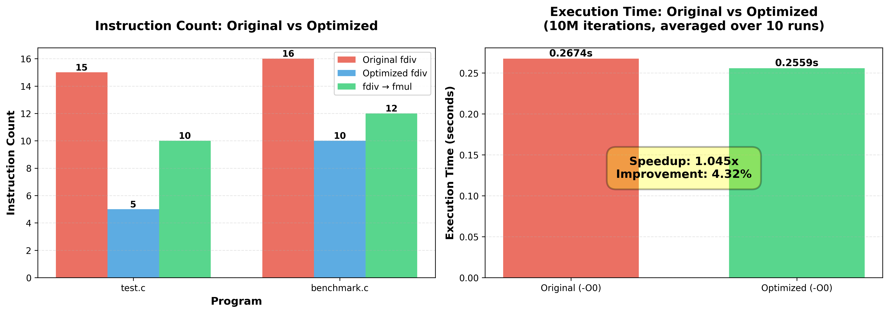

# LLVM Floating-Point Division Optimization Pass

### Team Members
Ning Wang (nw366), Jiale Lao (jl4492)

### Source Code
https://github.com/NingWang0123/cs6120/tree/main/assa7

### Implementations

- **`FloatDivLogger.cpp`**: An "unambitious" LLVM instrumentation pass that inserts printf statements before every floating-point division instruction to log when and where divisions occur. 

- **`FloatDivOptPass.cpp`**: An ambitious optimization pass that transforms floating-point divisions into multiplications to improve performance, since multiplication is typically faster than division on modern CPUs. The pass implements two strategies:
  - **Constant reciprocal**: Converts `x / C` → `x * (1/C)` when the denominator is a non-zero, non-NaN constant
  - **Reciprocal reuse**: When fast-math flags permit, converts `x / y` → `x * rcp(y)` and caches reciprocals within each basic block to avoid redundant `1/y` calculations when the same denominator is used multiple times

### Testing on Real Programs

We tested both passes on a real C program (`test.c`) containing diverse floating-point division patterns:

1. **Constant denominators** (e.g., `x/2.0f`, `x/3.0f`, `x/5.0f`) - always optimizable
2. **Repeated variable denominators** in the same basic block - benefits from reciprocal caching
3. **Loop-based divisions** - same denominator reused across iterations
4. **Branch-heavy code** - demonstrates per-basic-block optimization

#### Optimization Results

**Instruction Count Reduction:**
- `test.c`: **15 fdiv** → **5 fdiv** + **10 fmul** (66.7% converted to faster multiplication)
- `benchmark.c`: **16 fdiv** → **10 fdiv** + **12 fmul** (75% converted, includes reciprocal reuse)

**Execution Time (10M iterations, averaged over 10 runs):**
- Original (-O0): **0.2674 seconds**
- Optimized (-O0): **0.2559 seconds**
- **Speedup: 1.045x (4.32% improvement)**

**FloatDivLogger instrumentation:**
- Successfully logged **27 runtime divisions** across all function calls
- Demonstrated that instrumentation preserves program semantics (same output)

**Visualization:**

The figure shows both instruction count reduction and execution time improvement. The optimization pass successfully converts constant divisions to multiplications and reuses reciprocals for variable denominators within basic blocks.

### GenAI Usage
We use GPT-5 to generate the `visualize_results.py` to plot the optimization_results.png, which is a very nice figure: LLMs are very good at visualizations.

### The Hardest Part

The most challenging aspect was implementing correct reciprocal caching with proper handling of fast-math flags. We needed to understand LLVM's fast-math model (reciprocal transformation is only valid with appropriate flags), manage per-basic-block caching using DenseMap, and handle both scalar and vector types correctly.

### Michelin Star Justification

We implemented both an instrumentation pass and an optimization pass, tested them on real C programs with comprehensive benchmarking, and demonstrated measurable performance improvements. Although the optimization is not that significant (only 4%), this optimization is very fundamental as it is related to floating-point calculation and will be general to many programs. We think we deserve a michelin star. 