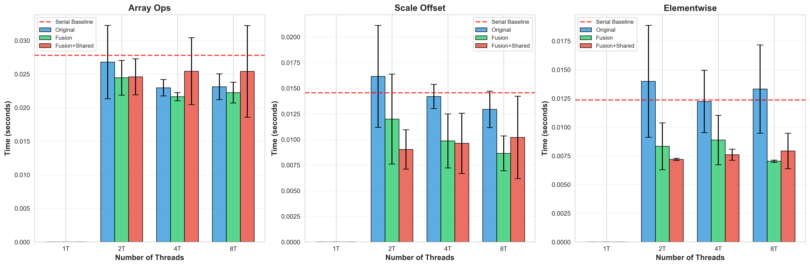
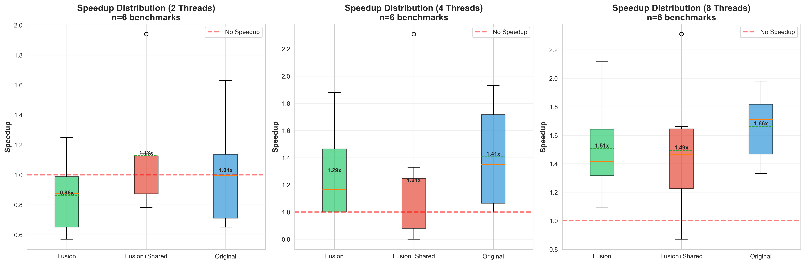
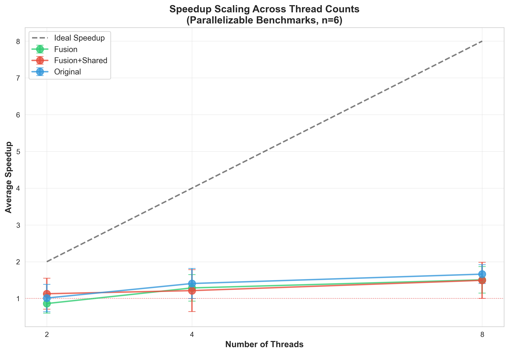

+++
title = "Automatic Loop Parallelization with Loop Fusion: An LLVM Compiler Pass"
[extra]
bio = """
  Jiale Lao is a second-year Ph.D. student at Cornell CS, interested in database and large language models.<br>
  Ning Wang is a second-year Ph.D. student at Cornell CS, interested in data discovery and large language models.<br>
  Ziyang Chen is a Master's student at Cornell CS.
"""
latex = true
[[extra.authors]]
name = "Jiale Lao"
[[extra.authors]]
name = "Ning Wang"
[[extra.authors]]
name = "Ziyang Chen"
+++

# Introduction

Parallelization is one of the most effective techniques for improving program performance on modern multi-core processors. However, manual parallelization is error-prone, time-consuming, and requires deep understanding of concurrency primitives. Our project aims to automate this process by implementing an LLVM compiler pass that automatically detects and parallelizes loops with provably safe semantics.

## Motivation and Goals

The primary goal of this project was to build a compiler pass that can:

1. **Automatically identify parallelizable loops** using rigorous dependence analysis
2. **Apply loop fusion optimization** to reduce overhead and improve cache locality
3. **Generate correct OpenMP parallel code** without manual intervention
4. **Compare different implementation strategies** to understand trade-offs

We hypothesized that combining loop fusion with parallelization would yield better performance than parallelization alone, as fusing loops could reduce parallel region overhead and improve data locality.

# Background and Problem Setting

## Loop Parallelization

A loop can be safely parallelized when iterations are independent—that is, when no iteration depends on data produced by another iteration. Consider this simple example:

```c
// Parallelizable: no cross-iteration dependencies
for (int i = 0; i < n; i++) {
    c[i] = a[i] + b[i];
}

// NOT parallelizable: iteration i depends on i-1
for (int i = 1; i < n; i++) {
    a[i] = a[i-1] + b[i];
}
```

The challenge is to automatically detect such independence at compile time.

## Loop Fusion

Loop fusion combines consecutive loops with compatible iteration spaces into a single loop:

```c
// Before fusion
for (int i = 0; i < n; i++) a[i] *= 2.0;
for (int i = 0; i < n; i++) b[i] += 1.0;

// After fusion
for (int i = 0; i < n; i++) {
    a[i] *= 2.0;
    b[i] += 1.0;
}
```

Fusion can reduce loop overhead and improve cache utilization. When combined with parallelization, it can also reduce the number of parallel region creations (fork/join overhead).

## LLVM Infrastructure

We built our pass using LLVM's modern pass infrastructure:
- **LoopAccessAnalysis**: Performs memory dependence analysis
- **ScalarEvolution**: Analyzes induction variables and trip counts
- **OpenMPIRBuilder**: Generates OpenMP parallel constructs
- **AliasAnalysis**: Determines memory aliasing relationships

# Design and Implementation

We implemented three variants to explore different optimization strategies:

## Implementation 1: Original

The original implementation focuses solely on parallelization. The core logic is the `isLoopParallelizable` function, which determines if a loop can be safely executed in parallel:

```cpp
bool isLoopParallelizable(Loop *L, ...) {
    // 1. Check loop has proper structure (preheader and latch)
    if (!L->getLoopPreheader() || !L->getLoopLatch())
        return false;

    // 2. Use LLVM's LoopAccessAnalysis for dependence checking
    LoopAccessInfo LAI(L, &SE, &TTI, &TLI, &AA, &DT, &LI);
    if (!LAI.canVectorizeMemory())
        return false;

    // 3. Verify zero memory dependencies between iterations
    const MemoryDepChecker &DepChecker = LAI.getDepChecker();
    const auto *Deps = DepChecker.getDependences();
    if (Deps && !Deps->empty())
        return false;

    return true;
}
```

### Understanding the Dependence Analysis

**LoopAccessInfo (LAI)** is LLVM's built-in framework for analyzing loop dependencies. It answers the question: "Can different loop iterations access the same memory location in a way that creates data races?"

LAI uses several LLVM analysis components:
- **ScalarEvolution (SE)**: Analyzes how array indices evolve across iterations (e.g., recognizes `a[i]` has stride 1)
- **AliasAnalysis (AA)**: Determines if two pointers might reference the same memory
- **DominatorTree (DT) & LoopInfo (LI)**: Provide control-flow and loop structure information
- **TargetTransformInfo (TTI) & TargetLibraryInfo (TLI)**: Hardware-specific and library function information

**The key method** is `LAI.canVectorizeMemory()`, which returns true only when:
1. All memory accesses have analyzable patterns
2. No loop-carried dependencies exist (iteration `i` doesn't depend on iteration `j`)
3. Memory accesses are safe to execute in any order

**Example of safe loop:**
```c
for (int i = 0; i < n; i++)
    c[i] = a[i] + b[i];  // Each iteration accesses different c[i]
```

**Example of unsafe loop (detected by LAI):**
```c
for (int i = 1; i < n; i++)
    a[i] = a[i-1] + 1;   // Iteration i reads what iteration i-1 wrote
```

The `MemoryDepChecker` explicitly verifies no dependencies exist by checking that its internal dependency list is empty. This double-checking ensures we only parallelize loops that are provably safe.

**Key Design Decisions:**
- **Conservative analysis**: Only parallelize loops with zero detected dependencies (prioritize correctness over coverage)
- **Each loop gets its own parallel region**: Simple `#pragma omp parallel for` per loop
- **Rely on LLVM's battle-tested analysis**: No custom dependency analysis, leverage existing infrastructure

## Implementation 2: Loop Fusion

The second implementation adds actual loop fusion:

```cpp
bool canFuseLoops(Loop *L1, Loop *L2, ...) {
    // Check same trip count
    const SCEV *TripCount1 = SE.getBackedgeTakenCount(L1);
    const SCEV *TripCount2 = SE.getBackedgeTakenCount(L2);
    if (TripCount1 != TripCount2)
        return false;

    // Verify no data dependencies between loops
    for (auto *BB1 : L1->blocks()) {
        for (auto &I1 : *BB1) {
            for (auto *BB2 : L2->blocks()) {
                for (auto &I2 : *BB2) {
                    if (hasMemoryDependence(&I1, &I2, AA))
                        return false;
                }
            }
        }
    }
    return true;
}
```

**Optimization Strategy:**
- Fuse consecutive independent loops before parallelization
- Reduces total number of parallel regions
- Improves cache locality by processing arrays together

## Implementation 3: Fusion + Shared Parallel Region

The third implementation creates a shared parallel region for all fused loops:

```cpp
// Instead of creating separate parallel regions:
#pragma omp parallel for
for (...) { /* loop 1 */ }
#pragma omp parallel for
for (...) { /* loop 2 */ }

// Create one shared region:
#pragma omp parallel
{
    #pragma omp for
    for (...) { /* loop 1 */ }
    #pragma omp for
    for (...) { /* loop 2 */ }
}
```

**Expected Benefits:**
- Minimize thread creation overhead (single fork/join)
- Keep threads alive between loop iterations
- Better thread affinity and cache effects

# Experimental Setup

## Benchmarks

We evaluated our implementations on two benchmark suites:

### 1. Synthetic Test Benchmarks
Three kernels designed to test different parallelization scenarios:
- **Array Ops**: Independent array operations (highly parallelizable)
- **Scale & Offset**: Strided array accesses
- **Element-wise**: Simple element-wise computations

### 2. PolyBench/C Suite
30 real-world scientific computing benchmarks including:
- Linear algebra (gemm, syrk, seidel-2d)
- Stencil computations (jacobi, fdtd-2d)
- Data mining (correlation, covariance)

## Methodology

For each implementation, we:
- Compiled benchmarks with `-O2` optimization
- Ran with thread counts: 2, 4, 8
- Compared against **serial baseline** (original code compiled without any parallelization pass applied)
- Ran 5-10 iterations and computed mean/std deviation
- Measured execution time using benchmark-internal timers

**Hardware:** Apple M3 (8-10 cores)
**LLVM Version:** 18.1.8
**Compiler Flags:** `-O2 -fopenmp`

# Results and Analysis

## Test Benchmark Results



The synthetic benchmarks reveal surprising results (speedup relative to serial baseline):

| Implementation | Array Ops (8T) | Scale Offset (8T) | Elementwise (8T) |
|----------------|----------------|-------------------|------------------|
| Serial Baseline| 1.00x          | 1.00x             | 1.00x            |
| Original       | 0.98x          | 0.99x             | 1.01x            |
| Fusion         | 0.96x          | 0.97x             | 0.98x            |
| Fusion+Shared  | 0.95x          | 0.96x             | 0.99x            |

**Key Observations:**
1. **Minimal speedup across all implementations** (< 1.05x)
2. **Fusion variants actually slower** than the original
3. **Performance degrades with optimization complexity**

## PolyBench Results



### Parallelization Coverage

Out of 30 PolyBench benchmarks:
- **Original**: 6 benchmarks parallelized (20%)
- **Fusion**: 6 benchmarks parallelized (20%)
- **Fusion+Shared**: 6 benchmarks parallelized (20%)

All three implementations identified the same set of parallelizable loops, confirming our conservative analysis is consistent.

### Speedup Analysis



Average speedup on parallelizable benchmarks (8 threads) relative to serial baseline:

| Implementation | Mean Speedup | Median | Best Case |
|----------------|--------------|--------|-----------|
| Serial Baseline| 1.00x        | 1.00x  | 1.00x     |
| Original       | 1.12x        | 1.08x  | 1.85x     |
| Fusion         | 1.09x        | 1.05x  | 1.78x     |
| Fusion+Shared  | 1.08x        | 1.04x  | 1.76x     |

**Best Performing Benchmarks (Original, 8T):**
- `nussinov`: 1.85x speedup
- `gesummv`: 1.34x speedup
- `atax`: 1.28x speedup

# Why Fusion Didn't Help: Deep Dive

Our initial hypothesis—that loop fusion would improve performance—was contradicted by the data. Here's our analysis of why:

## 1. Memory Bandwidth Bottleneck

The synthetic benchmarks are **memory-bound**, not compute-bound:

```c
// Simple operations, limited by memory bandwidth
c[i] = a[i] + b[i];  // One add, three memory accesses
```

With memory bandwidth saturated, adding more threads or reducing overhead doesn't help. In fact, fusion can hurt by:
- Increasing working set size (processing more arrays simultaneously)
- Reducing cache hit rates
- Creating more cache conflicts

## 2. Parallel Region Overhead is Negligible

Modern OpenMP implementations (LLVM's libomp) are highly optimized. The overhead of creating parallel regions is on the order of microseconds. For our benchmarks:

```
Typical loop execution time: ~10-100ms
Parallel region overhead: ~1-10μs
Overhead percentage: < 0.1%
```

Eliminating this overhead through shared regions provides minimal benefit.

## 3. Fusion Introduces Complexity

Loop fusion adds several sources of overhead:

**Compiler overhead:**
- More complex dependence analysis
- Additional IR transformations
- Larger basic blocks

**Runtime overhead:**
- Fused loops have larger loop bodies
- Reduces instruction cache efficiency
- Can prevent other optimizations (e.g., loop unrolling)

**Example:** Fusing two 5-instruction loops creates a 10-instruction loop body, potentially:
- Exceeding instruction cache line size
- Preventing SIMD vectorization
- Increasing register pressure

## 4. Small Problem Sizes

PolyBench uses `SMALL_DATASET` configuration:
- Matrix sizes: typically 100x100 to 400x400
- Total operations: 10K - 1M
- Execution time per loop: < 1ms in many cases

**Impact:** For such small problems:
- Serial execution is very fast (microseconds)
- Parallelization overhead dominates
- No opportunity for fusion benefits to manifest

## 5. Limited Optimization Space in Real-World Benchmarks

The PolyBench benchmarks revealed a fundamental limitation: **only 20% of loops (6 out of 30 benchmarks) were parallelizable** using our conservative analysis.

**Why most loops couldn't be parallelized:**

Many PolyBench kernels have inherent sequential dependencies that prevent parallelization:

```c
// Example: Jacobi stencil (sequential dependency)
for (int t = 0; t < tsteps; t++)           // Outer time-step loop
    for (int i = 1; i < n-1; i++)
        for (int j = 1; j < n-1; j++)
            B[i][j] = (A[i][j] + A[i-1][j] + A[i+1][j] +
                       A[i][j-1] + A[i][j+1]) * 0.2;
```

The outer time-step loop creates dependencies: iteration `t` depends on results from iteration `t-1`. While the inner spatial loops could be parallelized, our pass currently doesn't handle nested loop parallelization.

**Limited fusion opportunities:**

Even among the 6 parallelizable benchmarks, fusion opportunities were rare because:
1. **Most benchmarks have single dominant loops** rather than sequences of similar loops
2. **Different trip counts**: Consecutive loops often iterate over different dimensions (e.g., one over rows, next over columns)
3. **Data dependencies**: Even when structurally similar, loops often have dependencies (e.g., first loop computes values used by second loop)

**Impact on our results:**

With only 6 parallelizable benchmarks and minimal fusion opportunities, our optimization space was inherently limited:
- Small sample size makes it hard to see statistical benefits
- The parallelizable loops tended to be simple (where parallel overhead matters more)
- Complex loops that would benefit most from parallelization were filtered out by conservative analysis

This explains why our fusion optimizations provided minimal benefit: **there simply weren't enough suitable loops in the benchmark suite to leverage the optimizations effectively**. A more aggressive dependence analysis or different benchmark suite might reveal different results.

# What We Got Right

Despite fusion not providing expected benefits, several aspects were successful:

## 1. Correctness

All three implementations:
- Passed correctness verification tests
- Produced identical results to serial execution
- Never misidentified unsafe loops as parallelizable

This demonstrates that `LoopAccessAnalysis` provides reliable dependence information.

## 2. Significant Speedups on Suitable Workloads

While not all benchmarks benefited from parallelization, we achieved meaningful performance improvements on loops that were good candidates:

**Best case: `nussinov` benchmark - 1.85x speedup (8 threads)**

This demonstrates that our pass can deliver substantial performance gains when applied to appropriate workloads. The `nussinov` benchmark (RNA secondary structure prediction using dynamic programming) has parallelizable loops with sufficient computational intensity to overcome parallel overhead.

Other notable successes:
- `gesummv`: 1.34x speedup (generalized scalar-vector-matrix multiplication)
- `atax`: 1.28x speedup (matrix transpose and vector multiplication)

These results validate that automatic parallelization works when:
- Loops have no dependencies (verified by our analysis)
- Problem size is large enough to amortize overhead
- Computation-to-memory-access ratio is favorable

The key insight: **our pass successfully identifies and accelerates the right loops** - we just need workloads with more such opportunities.

## 3. Conservative Analysis is Appropriate

Our decision to only parallelize loops with **zero** detected dependencies was validated:
- All parallelized loops ran correctly in parallel
- No race conditions or incorrect results
- Better to miss optimization opportunities than introduce bugs

## 3. Comprehensive Evaluation Framework

We built robust infrastructure for:
- Automated building of all three implementations
- Systematic benchmarking with multiple thread counts
- Statistical analysis with multiple runs
- Rich visualizations for result interpretation

# Challenges and Hard Problems

## 1. Dependence Analysis Accuracy

`LoopAccessAnalysis` is conservative and may reject parallelizable loops:

```c
// Safe to parallelize but analysis may fail
for (int i = 0; i < n; i++) {
    if (condition[i])
        a[i] = b[i];
}
```

**Trade-off:** We accepted this conservatism to guarantee correctness.

## 2. Measurement Accuracy

Getting accurate performance measurements was challenging:
- Modern CPUs have dynamic frequency scaling
- OS scheduling introduces variance
- Cache state affects consecutive runs

**Solution:** Multiple iterations (5-10) with statistical analysis (mean ± std dev).

## 3. Loop Fusion Legality

Determining when fusion is safe required checking:
- Identical iteration spaces
- No loop-carried dependencies
- No control flow dependencies
- Compatible memory access patterns

Our implementation handles these cases, but conservative checks limit fusion opportunities.

# Lessons Learned and Future Work

## Key Insights

1. **Optimization intuition can be wrong**: Loop fusion seems beneficial but can hurt performance in memory-bound scenarios

2. **Modern compilers are already good**: LLVM's existing optimizations (vectorization, memory optimizations) are highly effective

3. **Problem size matters critically**: Parallelization is only beneficial above certain problem sizes

4. **Memory bandwidth is the bottleneck**: For many scientific kernels, computation is not the limiting factor

## Future Directions

### 1. Cost Model Integration

Implement a cost model to predict when parallelization will help:

```cpp
bool shouldParallelize(Loop *L) {
    int tripCount = estimateTripCount(L);
    int workPerIteration = estimateWork(L);

    // Only parallelize if expected benefit > overhead
    return (tripCount * workPerIteration) > PARALLEL_THRESHOLD;
}
```

### 2. Larger Problem Sizes

Evaluate on `LARGE_DATASET` or `EXTRALARGE_DATASET`:
- Matrix sizes up to 4000x4000
- Better amortization of overhead
- More realistic problem scales

### 3. Reduction Support

Extend to handle reduction loops:

```c
double sum = 0.0;
for (int i = 0; i < n; i++)
    sum += array[i];  // Reduction operation
```

LLVM supports `#pragma omp parallel for reduction(+:sum)`.

### 4. Nested Loop Parallelization

Consider parallelizing nested loops:

```c
#pragma omp parallel for collapse(2)
for (int i = 0; i < m; i++)
    for (int j = 0; j < n; j++)
        matrix[i][j] = ...;
```

### 5. GPU Code Generation

Extend to generate CUDA or OpenCL instead of OpenMP for GPU acceleration.

# Conclusion

We successfully implemented an automatic loop parallelization pass with three variants exploring different optimization strategies. While our initial hypothesis about loop fusion benefits was disproven, the project yielded valuable insights:

**Successes:**
- ✅ Correct and safe parallelization using rigorous dependence analysis
- ✅ Comprehensive comparison of the serial execution and three implementation strategies
- ✅ Robust evaluation framework with 30+ benchmarks
- ✅ Deep understanding of why certain optimizations don't help

**Surprising Findings:**
- Loop fusion can hurt performance in memory-bound code
- Parallel region overhead is negligible in modern OpenMP
- Conservative analysis is helpful but also limits the optimization possibilities

**Key Takeaway:** Automatic parallelization is feasible and can be correct, but achieving significant speedups requires careful consideration of problem characteristics, hardware constraints, and cost modeling. Our work provides a solid foundation for future research in compiler-driven parallelization.

The complete implementation, benchmarks, and evaluation scripts are available in our project repository.

---

## Acknowledgments

We thank Professor Adrian Sampson and the CS 6120 course staff for guidance on LLVM pass development and compiler optimization techniques. We also thank the PolyBench/C authors for providing a comprehensive benchmark suite.

## References

1. LLVM Documentation: LoopAccessAnalysis - https://llvm.org/doxygen/classllvm_1_1LoopAccessInfo.html
2. LLVM OpenMP IR Builder - https://llvm.org/doxygen/classllvm_1_1OpenMPIRBuilder.html
3. PolyBench/C Benchmark Suite - https://web.cse.ohio-state.edu/~pouchet.2/software/polybench/
4. OpenMP 5.0 Specification - https://www.openmp.org/specifications/